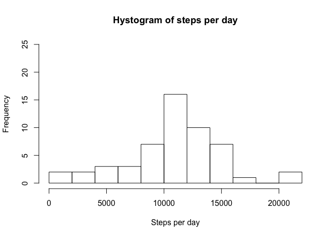
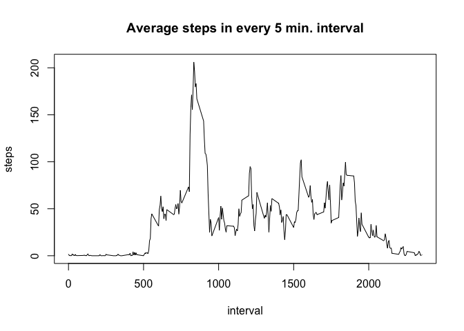
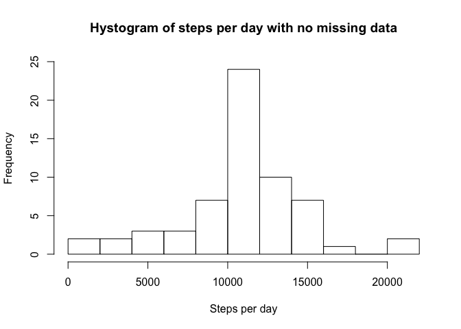
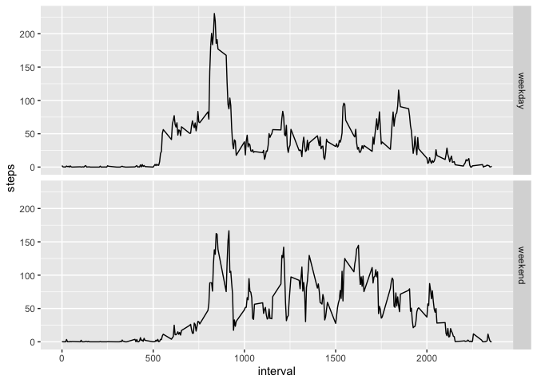

## Loading and preprocessing the data

Unzip and read the data set in "my_data" and perform date conversion

```r
library(dplyr)
```

```
## 
## Attaching package: 'dplyr'
```

```
## The following objects are masked from 'package:stats':
## 
##     filter, lag
```

```
## The following objects are masked from 'package:base':
## 
##     intersect, setdiff, setequal, union
```

```r
unzip("activity.zip")
my_data <- read.csv("activity.csv")
my_data$date <- as.Date(my_data$date,"%Y-%m-%d")
```

## What is mean total number of steps taken per day?

The number of steps per day are calculated in data frame "day_steps".
The histogram shows that not all days are the same, but the number of steps per day are distributed from 0 to 22,000 with a maximum between 10,000 and 12,000 steps.

```r
day_steps <- my_data %>% group_by(date) %>% summarize(steps = sum(steps))
hist(day_steps$steps, breaks = 10, main = "Hystogram of steps per day",
     xlab= "Steps per day",ylim = c(0,25))
```

<!-- -->

```r
steps_mean <- mean(day_steps$steps,na.rm = TRUE)
steps_median <- median(day_steps$steps,na.rm = TRUE)
```

The mean of the steps per day is steps_mean = 1.0766189\times 10^{4}
The median of the steps per day is steps_median = 10765

## What is the average daily activity pattern?
This is the time series plot of the 5-minute interval (x-axis) and the average number of steps taken, averaged across all days (y-axis).
It is calculated in data frame "avg_steps".

```r
avg_steps <- my_data %>% group_by(interval) %>% summarize(steps = mean(steps,na.rm=TRUE))
with(avg_steps,plot(interval,steps, type = "l", main = ("Average steps in every 5 min. interval")))
```

<!-- -->

```r
max_ind <- which.max(avg_steps$steps)
max_interval <- avg_steps$interval[max_ind]
```

The 5-minute interval, on average across all the days in the dataset, containing the maximum number of steps is calculated in max_interval = 835


## Imputing missing values

The total number of missing values in the dataset (i.e. the total number of rows with `NA`s) are calculated with the following code:

```r
N_missing <- sum(is.na(my_data$steps))
```
where the calculation is given by N_missing = 2304`

With the following code a new data frame "Nomiss_data" is calculated replacing the NA values with the corresponding mean for that 5-minute interval.

```r
Nomiss_data <- my_data
for(i in 1:length(my_data$steps)){
  if(is.na(Nomiss_data$steps[i])) {
    Nomiss_data$steps[i] <- avg_steps$steps[Nomiss_data$interval[i] == avg_steps$interval]
  }
}
```
In similar way as above, the new data frame Nom_day_steps calculates the average number of steps, averaged across all days.


```r
Nom_day_steps <- Nomiss_data %>% group_by(date) %>% summarize(steps = sum(steps))
hist(Nom_day_steps$steps, breaks = 10, main = "Hystogram of steps per day with no missing data",
     xlab= "Steps per day",ylim = c(0,25))
```

<!-- -->

```r
Nom_steps_mean <- mean(Nom_day_steps$steps)
Nom_steps_median <- median(Nom_day_steps$steps)
avg_steps_day <- sum(avg_steps$steps)
```

The corresponding histogram shows that only the bar including steps between 10,000 and 12,000 steps increase because the missing values have been replaced by data frame "avg_steps" and its mean = avg_steps_day = 1.0766189\times 10^{4} fall within this interval.
Furthermore, the mean of the steps per day is now Nom_steps_mean = 1.0766189\times 10^{4}
The median of the steps per day is Nom_steps_median = 1.0766189\times 10^{4}
In addition to notice that all these value are practically identical,it is worth noting that they don't differ at all from the mean of the steps per day with missing value = 1.0766189\times 10^{4}.

## Are there differences in activity patterns between weekdays and weekends?

Starting from the dataset with the filled-in missing values "Nomiss_data" a new factor called "week" is added. All its elements are initialized at the value "weekday". In a second step, all the location related to Saturday or Sunday, ("Sabato" and "Domenica" in Italian), are replaced with the value "weekend".
The panel plot of the 5-minute interval (x-axis) and the average number of steps taken, averaged across all weekday days or weekend days (y-axis), shows the different trends between weekdays and weekend.


```r
library(ggplot2)
Nomiss_data <- Nomiss_data %>% mutate(week = "weekday")
for(i in 1:length(Nomiss_data$steps)){
  if(((weekdays(Nomiss_data$date[i]))=="Sabato") |
     ((weekdays(Nomiss_data$date[i]))=="Domenica")) {
    Nomiss_data$week[i] <- "weekend"
  }
}
avg_steps_week <- Nomiss_data %>% group_by(interval,week) %>% summarize(steps = mean(steps))
qplot(interval,steps,data=avg_steps_week,geom = "line",facets=week~.)
```

<!-- -->

